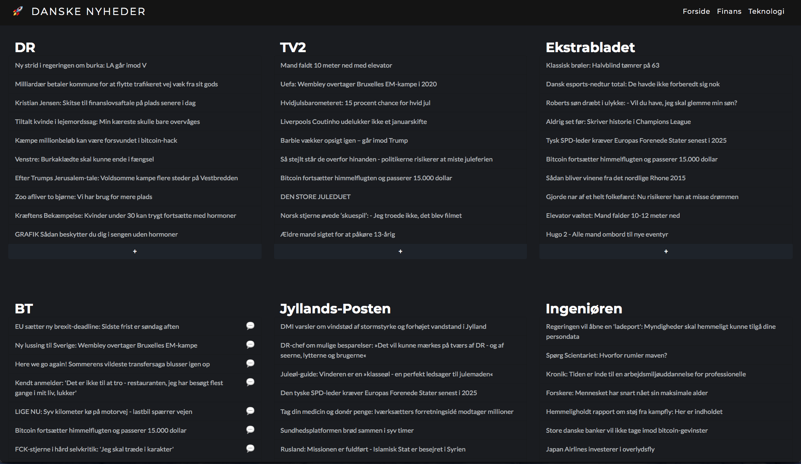

# 🐳 Dockerised news aggregator site 🐳

Project using _docker-compose_ to run two services. A _flask_ web server and a _python_ script to fetch RSS news feeds. 
Content is presented in a bootstrapped site inspired by [readspike.com](http://readspike.com)

## Screenshot

---
## Usage
To run, install docker and docker-compose and make sure the docker daemon is running. 
Now execute:
* _git clone https://github.com/simonfh/docker-news_
* _cd docker-news_
* _docker-compose up -d_

The website is now available at [localhost:5000](localhost:5000)

